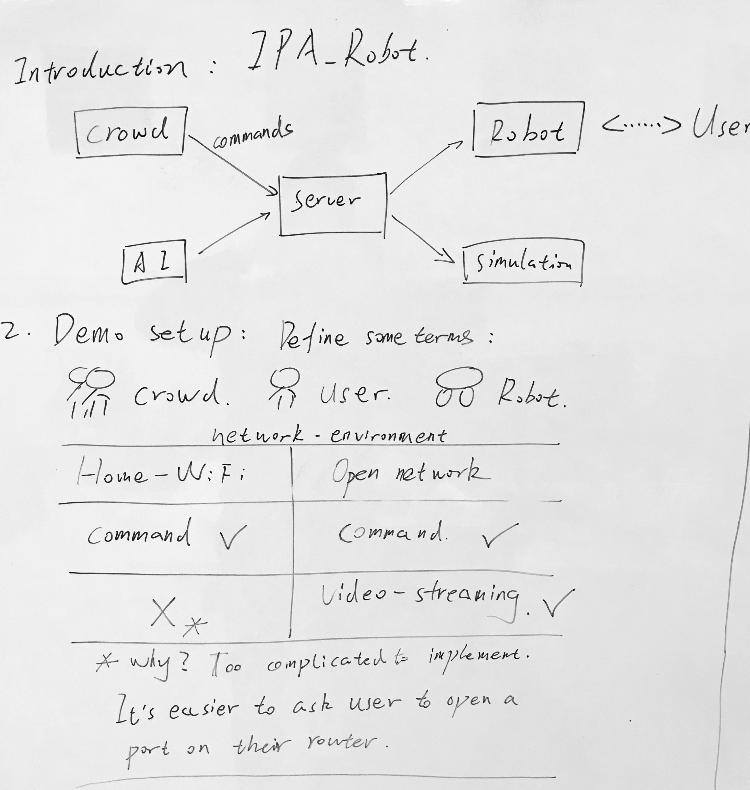
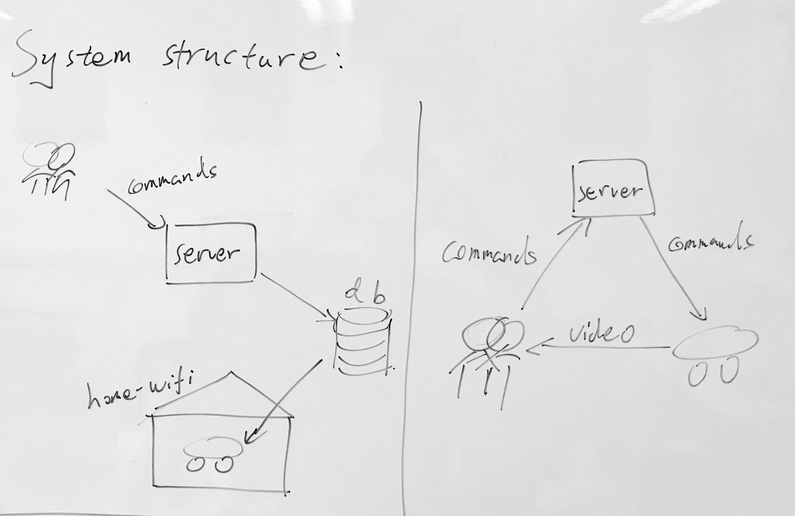
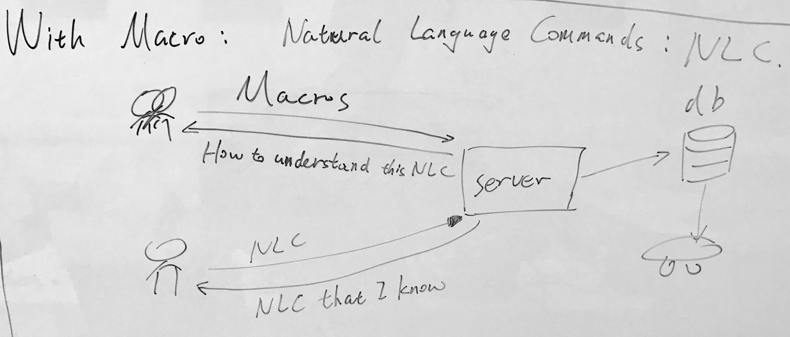
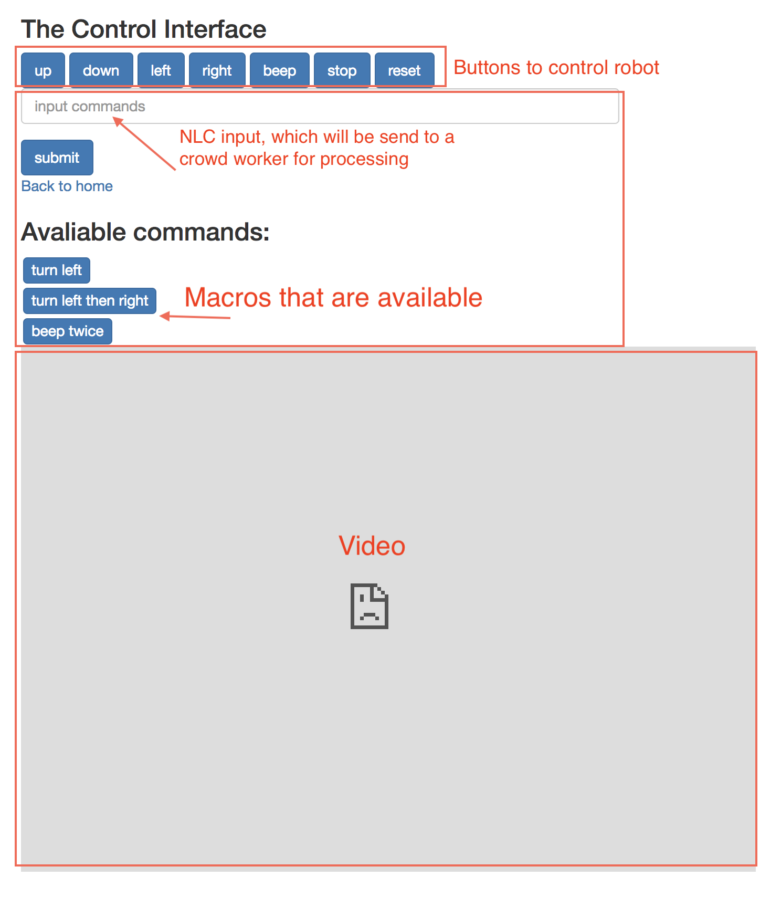

### IPA tech spec

1. ##### System Introduction

  

  We built a platform that enables crowd workers to control a robot through internet. 

  Our server provided API for crowd to send commands to one or multiple robots. The server is able to stream video from robot to crowd workers in local/open network. 

  However, if the robot is a home wifi, currently we are not able to get the video.  (Actually we can, but we need to ask user to open a port on their routers for each robot. Each robot need its own port, which is not ideal). 

2. ##### System Structure

  

  We built two sets of system structures:

  - The left one is used when the robot is under home wifi environment
  - The right one is used when the robot is under local/open network environment.

  Here are detailed explanations:

  - For the left, crowd worker will send commands to server. Then server will write the command into a database. Robot will read the database for commands and then operate accordingly. 
  - For the right, crowd worker will send commands to server. Then server will resend the commands to robots. User will directly get videos from robots by accessing video server on the robot.

3. ##### Macros with the System. 

  

  Our user might say some natural language commands (NLC) to the robot, such as "beep twice". If it is the first time for the robot to see the NLC, it will ask a crowd worker to translate that NLC to a series of commands and store that. This is built on top of the control and video system, and has been finished.

4. ##### Future Work.

   These are future works: (they seems pretty promising to me)

   - We found a technique using **RTMP protocol** to stream video out of a home wifi environment, which is one of our **future work**.

   Our goal is:

   - When the robot is under home wifi, enable crowd workers to control them and get video from them. Same structure with the first graph. 

5. ##### How to realize that. 

   There are lots of commercial softwares to realize live video streaming from home wifi, but they don't support RPi. We are basically building a live video platform exactly like YouTube live. Here are links about how we are going to do that:

   https://github.com/mpromonet/v4l2rtspserver

   https://raspberrypi.stackexchange.com/questions/23182/how-to-stream-video-from-raspberry-pi-camera-and-watch-it-live

6. #####Screenshots of the control interface:

  

